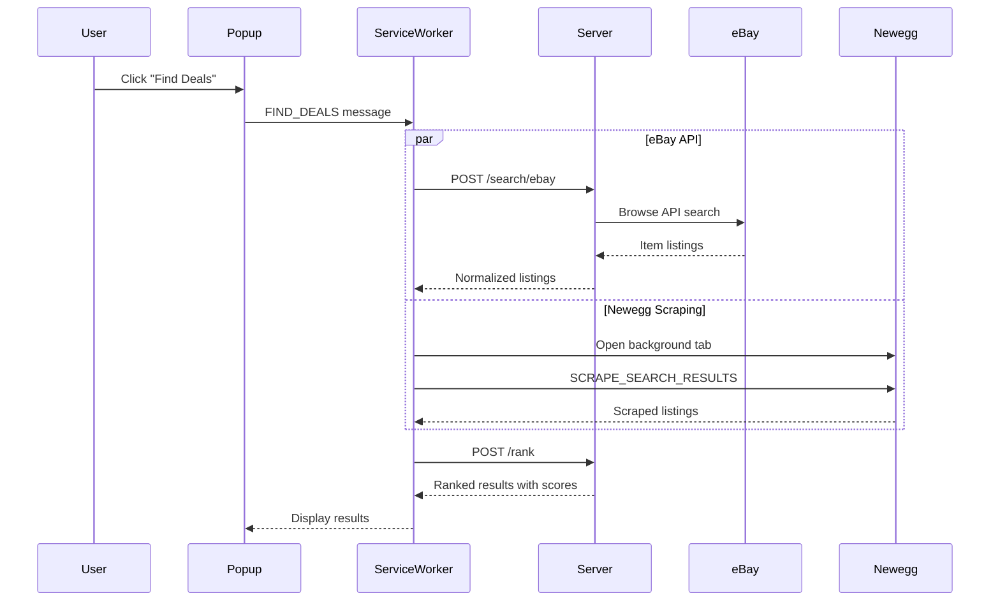

# Agentic Shopper - Architecture

## Overview

Agentic Shopper is a browser-based shopping assistant that combines a Chrome extension for browser automation with a local Python server for intelligent ranking.

```
┌─────────────────────────────────────────────────────────────────────────┐
│                         USER'S BROWSER                                   │
│  ┌─────────────────────────────────────────────────────────────────────┐│
│  │                     Chrome Extension                                 ││
│  │                                                                      ││
│  │   ┌──────────────┐        ┌────────────────────┐                    ││
│  │   │    Popup     │◄──────►│  Service Worker    │                    ││
│  │   │     UI       │        │   (Agent Loop)     │                    ││
│  │   └──────────────┘        └─────────┬──────────┘                    ││
│  │                                     │                                ││
│  │                           ┌─────────┴─────────┐                     ││
│  │                           ▼                   ▼                     ││
│  │              ┌─────────────────┐    ┌─────────────────┐             ││
│  │              │ Content Scripts │    │   Tab Actions   │             ││
│  │              │  (Page Parse)   │    │ (Group, Open)   │             ││
│  │              └─────────────────┘    └─────────────────┘             ││
│  └─────────────────────────────────────────────────────────────────────┘│
└────────────────────────────────────┬────────────────────────────────────┘
                                     │ HTTP (localhost:8000)
                                     ▼
┌─────────────────────────────────────────────────────────────────────────┐
│                         LOCAL PYTHON SERVER                              │
│                                                                          │
│   ┌──────────────────┐    ┌──────────────────┐    ┌──────────────────┐  │
│   │    FastAPI       │    │    Scoring       │    │   eBay API       │  │
│   │   /rank          │◄───│    Engine        │    │   Connector      │  │
│   │   /search/ebay   │    │                  │    │                  │  │
│   └──────────────────┘    └──────────────────┘    └──────────────────┘  │
│                                                                          │
│   ┌──────────────────┐                                                   │
│   │    SQLite DB     │ (Optional - for history)                         │
│   └──────────────────┘                                                   │
└─────────────────────────────────────────────────────────────────────────┘
```

## Component Details

### Chrome Extension

| Component | Purpose |
|-----------|---------|
| **Popup UI** | User interface for preferences, search, results display |
| **Service Worker** | Agent loop orchestrator, API calls, tab management |
| **Content Scripts** | Page parsing, element highlighting, scraping |
| **Shared Modules** | Schema definitions, messaging protocol |

### Python Server

| Component | Purpose |
|-----------|---------|
| **FastAPI App** | REST API endpoints with CORS |
| **Scoring Engine** | Deterministic feature scoring + ranking |
| **eBay Connector** | OAuth + Browse API integration |
| **SQLite Storage** | History and preferences persistence |

## Data Flow

### Find Deals Flow



## Scoring Algorithm

Each listing receives a score in [0, 1] for 5 components:

1. **Price Score**: Budget comparison with scaling
2. **Delivery Score**: ETA days mapping with priority adjustment
3. **Reliability Score**: Seller rating + review count (log transform)
4. **Returns Score**: Window days mapping
5. **Spec Match Score**: Keyword/brand matching

Final score = Σ (weight × component_score)

Default weights sum to 1.0.
